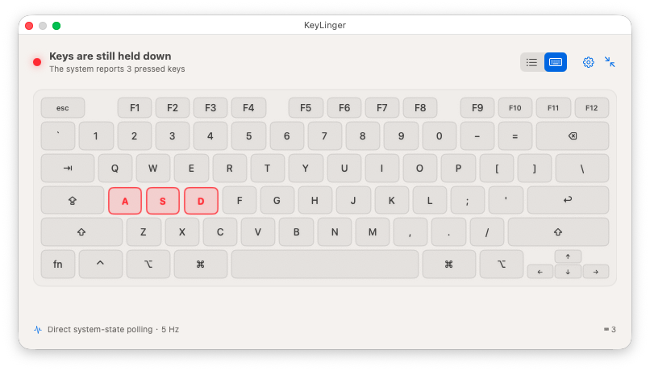
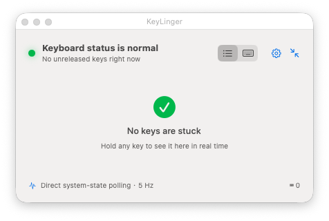
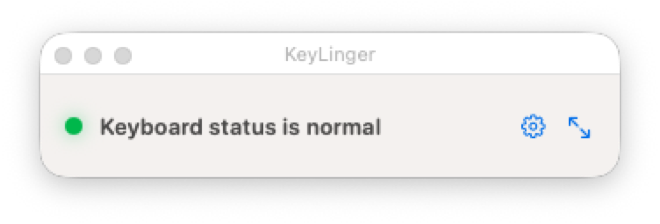
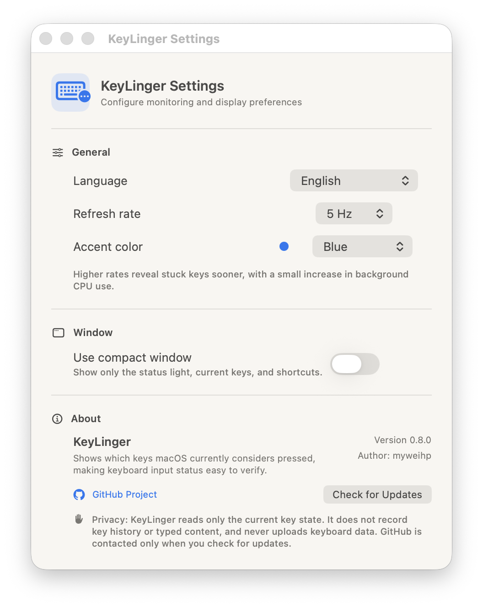

<p align="right">
  <strong>English</strong> ·
  <a href="README.zh-Hans.md">简体中文</a> ·
  <a href="README.zh-Hant.md">繁體中文</a>
</p>

# KeyLinger

[](https://github.com/myweihp/KeyLinger/actions/workflows/ci.yml)
[](https://github.com/myweihp/KeyLinger/releases/latest)
[](LICENSE)

> See which keys macOS still believes are pressed.

KeyLinger is a small macOS diagnostic utility that **queries the current keyboard state** instead of reconstructing it from a stream of `keydown` and `keyup` events.

That distinction matters. An event listener only knows about events received after it starts. If a remote-desktop session, virtual machine, input utility, or application loses a `keyup`, opening an event viewer afterwards may be too late. KeyLinger asks macOS what the current session reports *right now*, so a key that was already stuck can appear on the first poll.

## Why it is different

| | Event-stream approach | KeyLinger |
| --- | --- | --- |
| Data source | New key events received after launch | Current key state reported by macOS |
| Key stuck before launch | Usually cannot be inferred | Can be visible immediately |
| Primary purpose | Inspect incoming input events | Diagnose the session's current held-key state |
| History | May retain an event log | Keeps no key history |

Internally, KeyLinger polls:

```swift
CGEventSource.keyState(.combinedSessionState, key: keyCode)
```

The default polling rate is 10 Hz and can be set from 2 to 30 Hz. KeyLinger is read-only: it does not synthesize key events or attempt to release a stuck key.

## Interface

<table>
  <tr>
    <td width="50%" valign="top">
      <p align="center">
        <strong>Keyboard map</strong><br>
        <sub>Pressed keys stand out immediately; keys outside the ANSI map remain visible below it</sub>
      </p>
      <a href="docs/images/keylinger-main-en.png">
        
      </a>
    </td>
    <td width="50%" valign="top">
      <p align="center">
        <strong>Key list</strong><br>
        <sub>A compact textual view for reading the current result at a glance</sub>
      </p>
      <a href="docs/images/keylinger-list-en.png">
        
      </a>
    </td>
  </tr>
  <tr>
    <td width="50%" valign="top">
      <p align="center">
        <strong>Compact mode</strong><br>
        <sub>A status-focused view that fits at the edge of the screen</sub>
      </p>
      <a href="docs/images/keylinger-compact-en.png">
        
      </a>
    </td>
    <td width="50%" valign="top">
      <p align="center">
        <strong>Settings</strong><br>
        <sub>Language, polling rate, appearance, privacy information, and update checks</sub>
      </p>
      <a href="docs/images/keylinger-settings-en.png">
        
      </a>
    </td>
  </tr>
</table>

## When it is useful

- A modifier, letter, number, or Space remains logically pressed after a remote session.
- An application behaves as though a key is held down, but the source is unclear.
- You want to inspect the current session state without recording what was typed.
- You need to check a suspected stuck key after the problem has already occurred.

The original motivation was diagnosing lost `keyup` signals in RustDesk sessions; the same state-query approach is useful for any application that appears to have a key stuck down.

## Features

- Responsive MacBook/ANSI keyboard map with a clear pressed-key state.
- Key-list view for a compact textual diagnosis.
- Fallback labels for numpad, ISO, JIS, and other keys outside the visual map.
- Floating panel that can remain visible across Spaces, plus a menu-bar entry.
- Compact window mode for status-only monitoring.
- Configurable 2–30 Hz polling rate and persistent display preferences.
- English, Simplified Chinese, and Traditional Chinese interface languages.
- Native Apple Silicon and Intel builds.

## Download and install

Download the appropriate DMG from [GitHub Releases](https://github.com/myweihp/KeyLinger/releases/latest):

- **Apple Silicon:** choose the file containing `Apple-Silicon` for M-series Macs.
- **Intel:** choose the file containing `Intel`.

Open the DMG and drag `KeyLinger.app` into Applications.

The current builds use an ad-hoc signature and are not notarized with an Apple Developer ID. On first launch, macOS may block the app. In Finder, Control-click or right-click KeyLinger, choose **Open**, and confirm the prompt.

## Permission and system requirements

- macOS 13 or later.
- Input Monitoring permission is required to reliably read ordinary keys such as letters, numbers, and Space while another application has focus.
- After granting permission, KeyLinger may need to be restarted before background detection becomes available.

KeyLinger shows a permission notice and can open the relevant System Settings page when access is missing.

## Privacy

KeyLinger reads only the set of keys that macOS currently reports as pressed. It does not keep a key-event history, reconstruct typed text, write keyboard data to disk, or upload keyboard data.

The app accesses GitHub only when you manually choose **Check for Updates**.

## Build from source

Build and open a native app bundle:

```bash
./build_app.sh release native
open "dist/KeyLinger.app"
```

Run directly with Swift Package Manager during development:

```bash
swift run KeyLinger
```

Build architecture-specific apps and DMGs:

```bash
./build_app.sh release arm64
./scripts/create_dmg.sh arm64

./build_app.sh release x86_64
./scripts/create_dmg.sh x86_64
```

A local universal app can be built with `./build_app.sh release universal`. The keyboard-map data can be checked independently with:

```bash
swift run KeyLinger --validate-keyboard-layout
```

## Known limitations

- KeyLinger reports the logical state of the current macOS session, not the electrical state of the physical keyboard.
- The visual map currently uses a common MacBook/ANSI arrangement. Pressed numpad, ISO, JIS, and other out-of-layout keys appear as fallback labels instead of disappearing.
- Some vendor-specific function keys, Touch Bar actions, and consumer/media keys do not use standard virtual key codes and may not be visible.
- KeyLinger diagnoses a stuck state; it does not forcibly release or modify keys.

## Documentation languages

- **English**
- [简体中文](README.zh-Hans.md)
- [繁體中文](README.zh-Hant.md)

## License

KeyLinger is available under the [MIT License](LICENSE).
