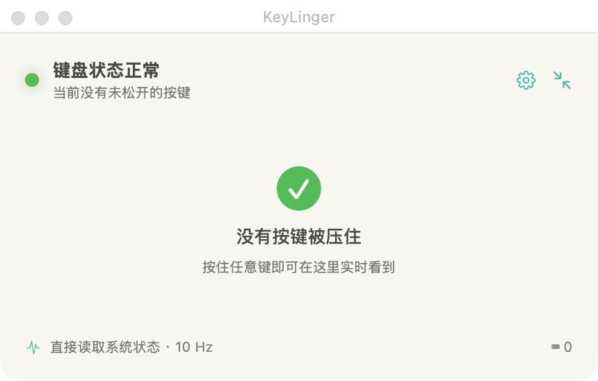
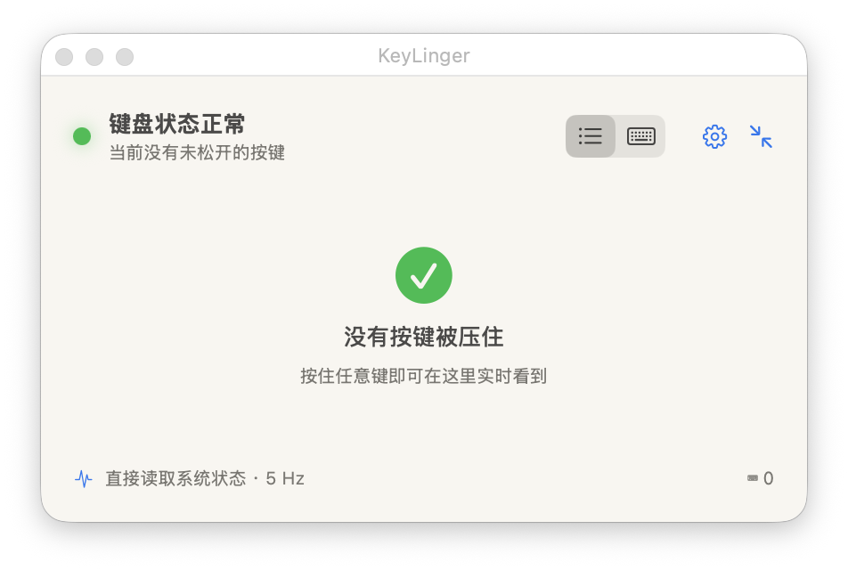
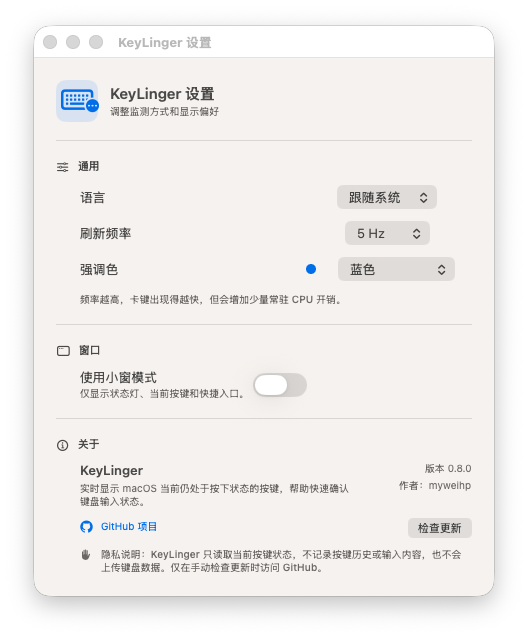

<p align="right">
  <a href="README.md">English</a> ·
  <strong>简体中文</strong> ·
  <a href="README.zh-Hant.md">繁體中文</a>
</p>

# KeyLinger

[](https://github.com/myweihp/KeyLinger/actions/workflows/ci.yml)
[](https://github.com/myweihp/KeyLinger/releases/latest)
[](LICENSE)

> 查看 macOS 此刻仍然认为处于按下状态的按键。

KeyLinger 是一款轻量的 macOS 键盘状态诊断工具。它**直接查询当前键位状态**，而不是依靠收到的 `keydown` 和 `keyup` 事件去还原状态。

这正是它与普通按键测试工具不同的地方。事件监听器只知道启动之后收到的事件；如果远程桌面、虚拟机、输入工具或某个应用漏掉了一次 `keyup`，事后再打开事件查看器往往已经无法还原现场。KeyLinger 会直接询问 macOS 当前会话“哪些键仍被认为按着”，因此在启动前就已经卡住的键，也能在第一次读取时出现。

## 它有什么不同

| | 事件监听方式 | KeyLinger |
| --- | --- | --- |
| 数据来源 | 启动后新收到的键盘事件 | macOS 当前报告的键位状态 |
| 启动前已经卡住的键 | 通常无法从缺失的事件中推断 | 可以立即显示 |
| 主要用途 | 观察接下来发生的输入事件 | 诊断当前会话的按键状态 |
| 历史记录 | 可能保留事件日志 | 不保存按键历史 |

KeyLinger 内部持续查询：

```swift
CGEventSource.keyState(.combinedSessionState, key: keyCode)
```

默认读取频率为 10 Hz，可在 2–30 Hz 之间调整。KeyLinger 只读状态，不会模拟按键事件，也不会尝试强制松开卡住的键。

## 界面

<table>
  <tr>
    <td width="50%" valign="top">
      <p align="center">
        <strong>键盘 Map</strong><br>
        <sub>被按下的键一目了然；ANSI 布局之外的键仍会显示在下方</sub>
      </p>
      <a href="docs/images/keylinger-main.png">
        
      </a>
    </td>
    <td width="50%" valign="top">
      <p align="center">
        <strong>按键列表</strong><br>
        <sub>用紧凑的文字列表快速读取当前结果</sub>
      </p>
      <a href="docs/images/keylinger-list.png">
        
      </a>
    </td>
  </tr>
  <tr>
    <td width="50%" valign="top">
      <p align="center">
        <strong>小窗模式</strong><br>
        <sub>只保留核心状态，适合放在屏幕边缘</sub>
      </p>
      <a href="docs/images/keylinger-compact.png">
        
      </a>
    </td>
    <td width="50%" valign="top">
      <p align="center">
        <strong>设置</strong><br>
        <sub>语言、读取频率、外观、隐私说明和更新检查</sub>
      </p>
      <a href="docs/images/keylinger-settings.png">
        
      </a>
    </td>
  </tr>
</table>

## 适用场景

- 远程控制结束后，修饰键、字母、数字或空格仍被系统认为处于按下状态。
- 某个应用表现得像一直按着某个键，但一时无法确定来源。
- 希望检查当前会话状态，又不想记录实际输入过的内容。
- 问题已经发生，需要事后确认究竟是哪个键卡住。

项目最初源于排查 RustDesk 会话中丢失 `keyup` 信号的问题；同样的状态查询方式也适用于任何表现出“卡键”现象的应用。

## 功能

- 响应式 MacBook/ANSI 键盘 Map，清晰标出按下状态。
- 按键列表视图，适合用文字快速确认结果。
- 数字小键盘、ISO、JIS 等 Map 外按键通过标签兜底显示。
- 可跨桌面显示的置顶面板，以及常驻菜单栏入口。
- 适合放在屏幕边缘的小窗模式。
- 2–30 Hz 可调读取频率，显示偏好自动保存。
- English、简体中文和繁體中文界面。
- 分别提供 Apple Silicon 与 Intel 原生版本。

## 下载与安装

前往 [GitHub Releases](https://github.com/myweihp/KeyLinger/releases/latest) 下载对应的 DMG：

- **Apple Silicon：** M 系列 Mac 选择文件名包含 `Apple-Silicon` 的版本。
- **Intel：** 选择文件名包含 `Intel` 的版本。

打开 DMG，将 `KeyLinger.app` 拖入 Applications。

目前的安装包使用 ad-hoc 签名，尚未通过 Apple Developer ID 公证。首次启动时 macOS 可能会阻止打开；请在 Finder 中按住 Control 点按或右键点按 KeyLinger，选择**打开**，再确认提示。

## 权限与系统要求

- macOS 13 或更高版本。
- 当焦点位于其他应用时，要可靠读取字母、数字和空格等普通按键，需要授予“输入监控”权限。
- 授权后可能需要重启 KeyLinger，失焦检测才会生效。

权限缺失时，KeyLinger 会显示说明，并可打开对应的系统设置页面。

## 隐私

KeyLinger 只读取 macOS 当前报告为“按下”的键集合。它不会保存按键事件历史、还原输入内容、把键盘数据写入磁盘，也不会上传键盘数据。

只有手动点击**检查更新**时，程序才会访问 GitHub。

## 从源码构建

构建并打开当前机器的 App：

```bash
./build_app.sh release native
open "dist/KeyLinger.app"
```

开发时也可以通过 Swift Package Manager 直接运行：

```bash
swift run KeyLinger
```

分别构建不同架构的 App 与 DMG：

```bash
./build_app.sh release arm64
./scripts/create_dmg.sh arm64

./build_app.sh release x86_64
./scripts/create_dmg.sh x86_64
```

运行 `./build_app.sh release universal` 可以在本地生成通用 App。键盘布局数据也可以单独校验：

```bash
swift run KeyLinger --validate-keyboard-layout
```

## 已知边界

- KeyLinger 显示的是 macOS 当前会话的逻辑状态，而不是物理键盘的电气状态。
- 键盘 Map 当前采用常见的 MacBook/ANSI 排列；数字小键盘、ISO、JIS 等布局外键被按下时会以标签显示，不会从诊断结果中消失。
- 部分厂商自定义功能键、Touch Bar 动作或消费类媒体键不使用标准虚拟键码，可能无法显示。
- KeyLinger 用于诊断卡键，不会强制修改或释放按键状态。

## 文档语言

- [English](README.md)
- **简体中文**
- [繁體中文](README.zh-Hant.md)

## 许可证

KeyLinger 使用 [MIT License](LICENSE) 开源。
